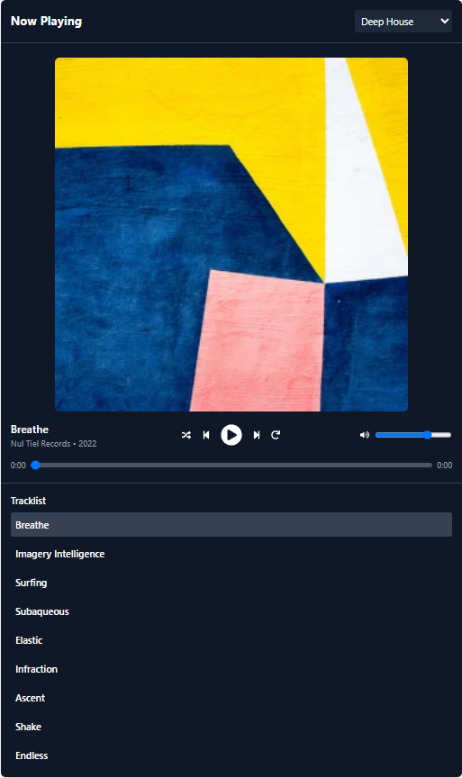

# Linear Media Player

## Project Overview

- **Display**: Shows current track name, artist, and release year from playlist metadata.
- **Controls**: Play/Pause, Next, Previous, Shuffle, Loop, Mute/Unmute, Volume slider.
- **Seek**: Touchable progress bar with timestamps (current time / total duration).
- **Cover Art**: Displays album cover based on playlist.

## Screenshot

## Deployment

This app is deployed on Vercel:

- **GitHub repo**: [https://github.com/Guan-Eric/linear-media-player](https://github.com/Guan-Eric/linear-media-player)
- **Deployed app**: [https://linear-media-player-psi.vercel.app/](https://linear-media-player-psi.vercel.app/)

## Component Structure

- **MediaPlayer.tsx**: Main wrapper, state management, and audio element.
- **PlayerHeader.tsx**: Playlist selector and title bar.
- **NowPlaying.tsx**: Shows track details (name, artist, year, cover art), and controls.
- **CurrentPlaylist.tsx**: Scrollable track list.

## Technologies

- **Framework**: React + Vite
- **Styling**: Tailwind CSS
- **Icons**: React Icons (Font Awesome)
- **Deployment**: Vercel

## Attribution

This project includes music from the following albums:

- "Deep House" by Nul Tiel Records is licensed under CC BY-NC-SA 4.0.
- "Neither and Both" by Brylie Christopher Oxley is licensed under CC BY 4.0.
